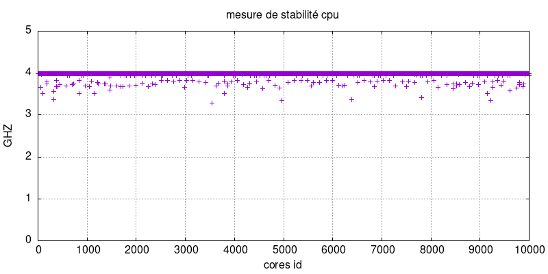
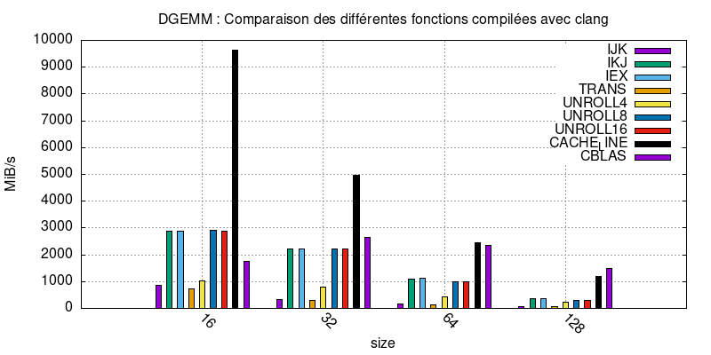
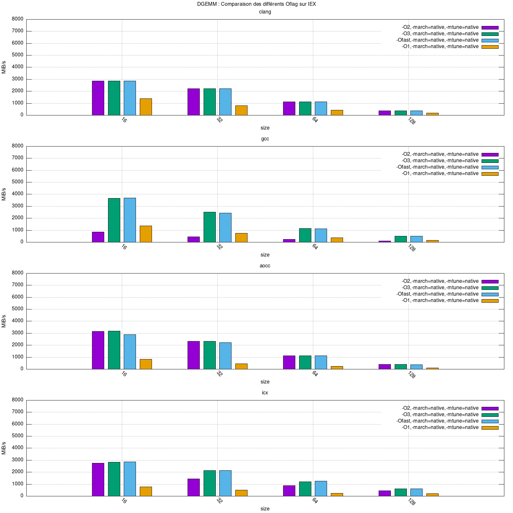
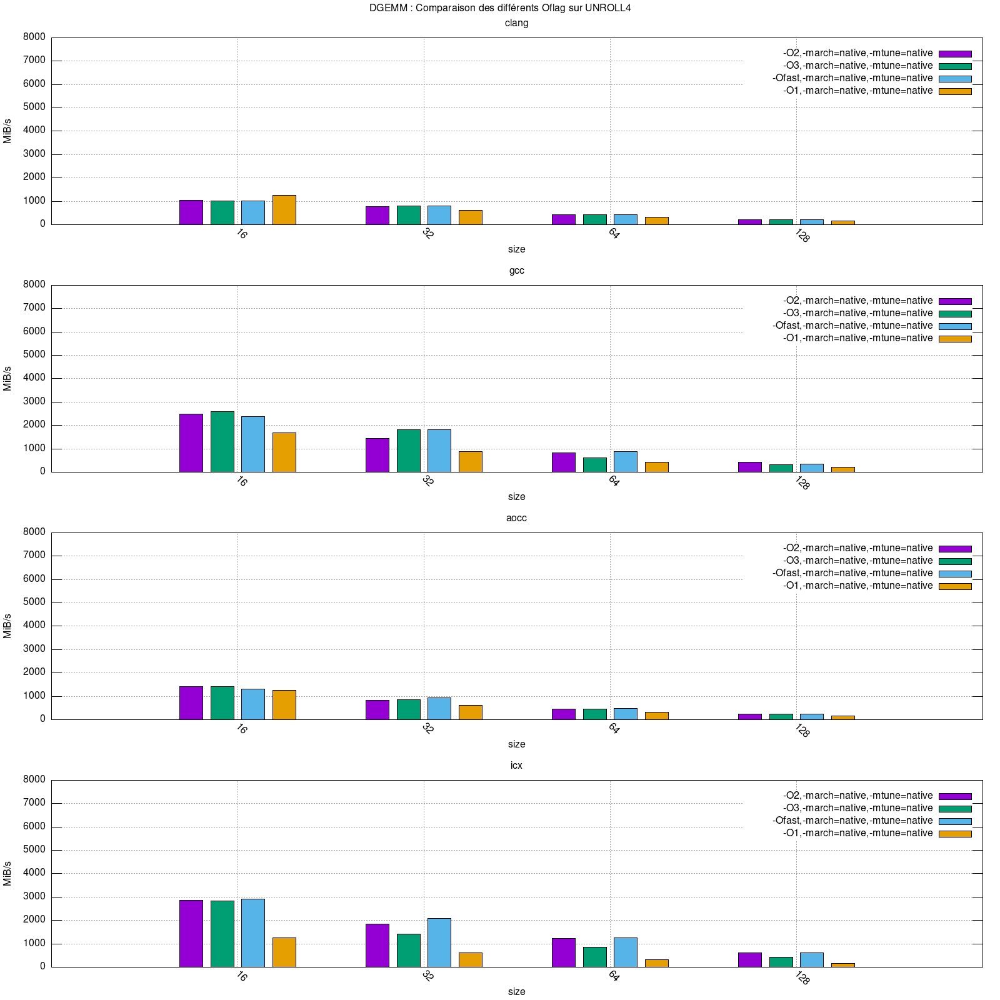
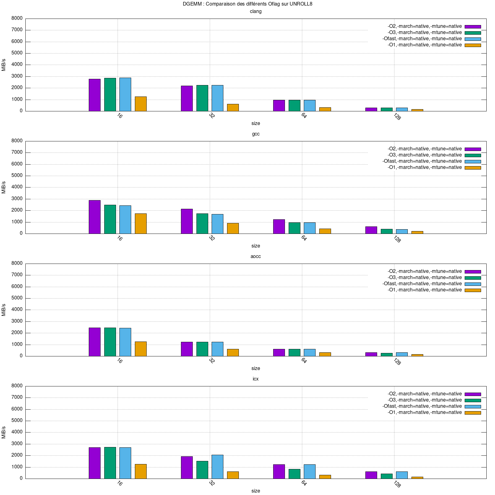
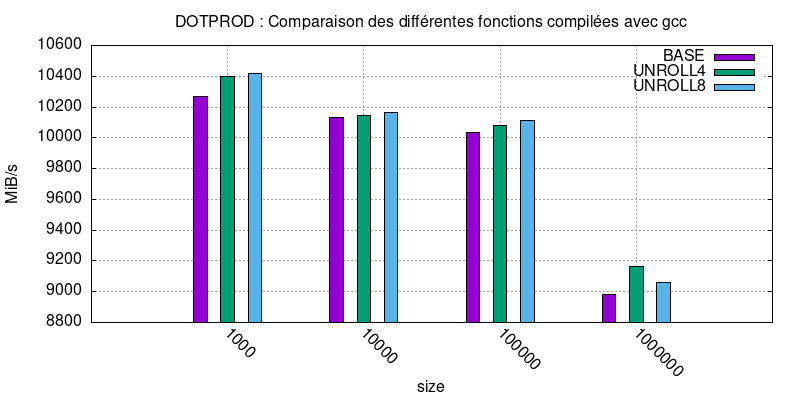
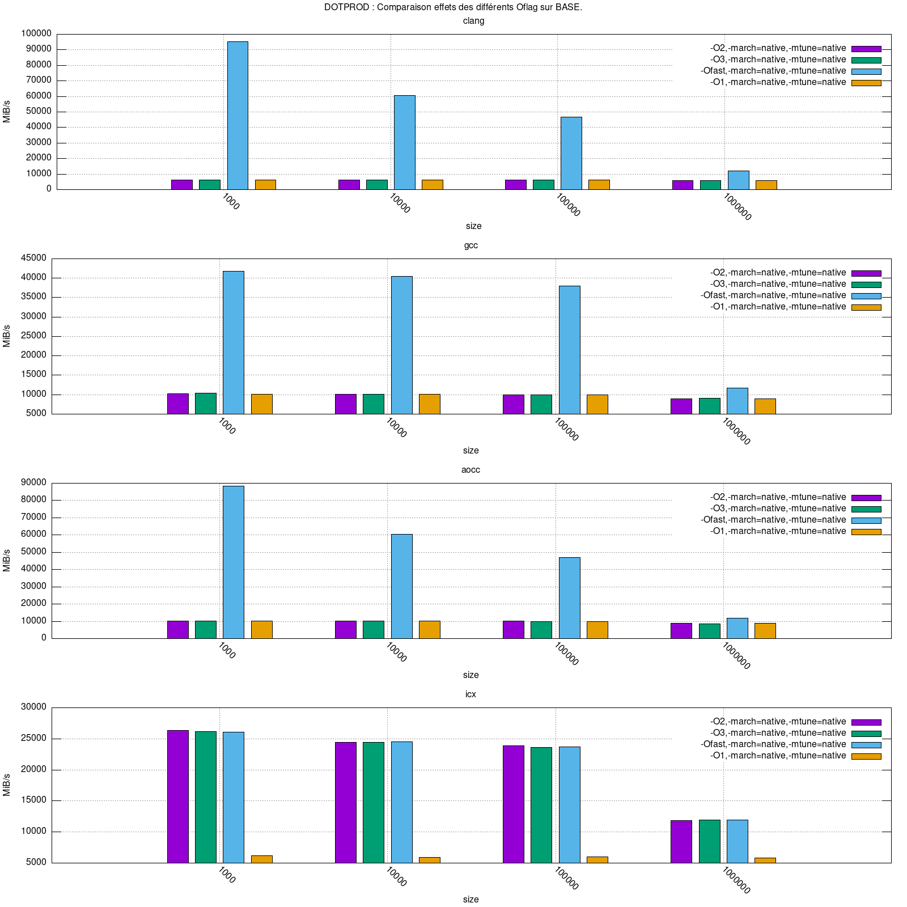
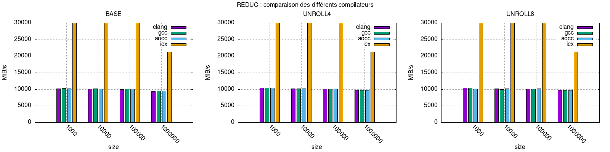
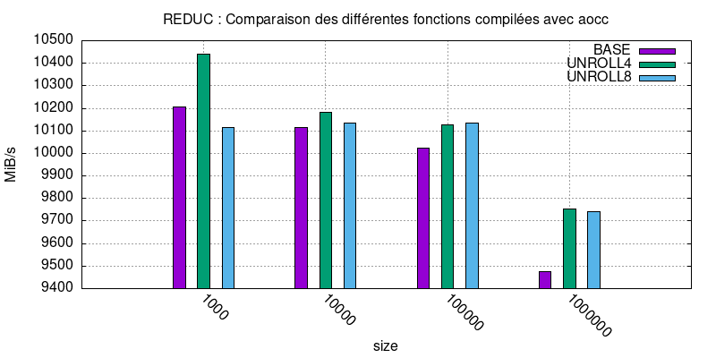
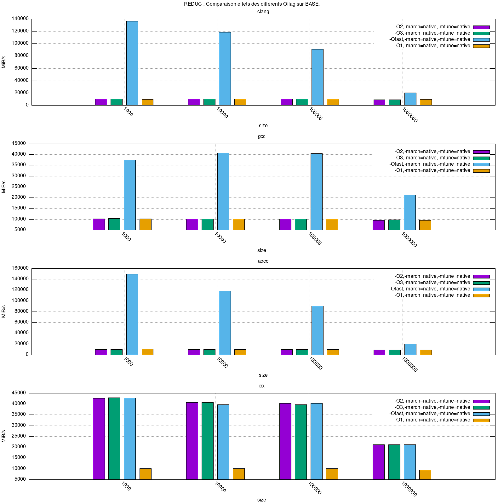

# Compte Rendu projet OBHPC

## I] AMD RYZEN

### 1) Compilers and environment

#### 1.1) Compilers

* gcc (GCC) 12.2.0
* clang version 14.0.6
* AMD clang version 13.0.0 (CLANG: AOCC_3.2.0-Build#128 2021_11_12) (based on LLVM Mirror.Version.13.0.0)
* Intel(R) oneAPI DPC++/C++ Compiler 2022.2.1

#### 1.2) Environment

* les benchmarks ci-dessous n'ayant pas été multi-threadés tournent ont été fixés sur le core 4 avec taskset.
* La fréquence du cpu a été réglée a son maximum grace au gouverneur 'performance' de cpupower
* Le Turbo boost est activé 

### 2) Architecture

   * CPU name : AMD Ryzen 5 PRO 4650U 
   * MicroArchitecture : Zen2
   * Sockets : 1
   * Cores per socket : 6
   * Threads per core : 2
   * Cache line size : 64 Bytes
   * Level 1 cache size: 32*6 KiB
   * Level 1 nb ways : 8
   * Level 2 cache size: 512*6 KiB
   * Level 2 nb ways : 8
   * Level 3 cache size: 4MiB * 2 (shared between 3 cores)
   * Level 3 nb ways : 16
   * RAM : 16 GiB 
   * Instruction sets : SSE, AVX2
   * Min Frequency: 1.4 GHZ
   * Max Frequency: 2.1 GHZ
   * Turbo Frequency: 4.0 GHZ

### 3) STABILITY

Le but de ce benchmark est d'executer une fonction dont le nombre de cycles est déja connu, 
puis de diviser le temps pris par cette fonction par le nombre de cycle théorique afin d'en 
déduire la fréquence du cpu.

Ce benchmark est d'abord executé sur un seul core N fois afin de voir la stabilité d'un seul 
core au cours du temps. (voir figure 1)

Puis il est executé en parallèle sur 1,2,3,...,n cores afin de voir la stabilité de chaque core 
quand ils sont executés en parallèle. (voir figure 2)

todo

todo

### 4) LATENCY

Le but de ce benchmark est de mettre en avant le temps d'acces aux différents caches.
Pour cela, nous utilisions la fonction "pointeur chasing", qui utilise une liste de pointeur 
pointant sur eux meme, la mélange et la parcours. Comme le parcours est aléatoire.

Quand la liste peut etre stockée dans le cache L1, le temps d'acces aux données est théoriquement
le meme que le temps d'acces au cache L1. Pareil pour le cache L2, L3 et la RAM.

todo

### 5) DGEMM

Les histogrames présents ci dessous représentent comparent l'efficacité de divers critères pour 
résoudre des multiplications de matrices. 
Ces critères seront : 

    * la fonction utilisée pour résoudre la dgemm
    * le compilateur
    * les flags d'optimisations

#### 5.1) Comparaison des compilateurs sur chaque fonction

todo

#### 5.2) Comparaison des fonctions pour chaque compilateur

todo

#### 5.3) Comparaison de la performance des flags d'optimisation

### 6) DOTPROD

Les histogrames présents ci dessous représentent comparent l'efficacité de divers critères pour 
effectuer des dotprods. 
Ces critères seront : 

    * la fonction utilisée pour résoudre un dotprod
    * le compilateur
    * les flags d'optimisations

#### 6.1) Comparaison des compilateurs sur chaque fonction

todo

#### 6.2) Comparaison des fonctions pour chaque compilateur

todo

#### 6.3) Comparaison de la performance des flags d'optimisation

<!--  -->

### 7) REDUC

Les histogrames présents ci dessous représentent comparent l'efficacité de divers critères pour 
effectuer des dotprods. 
Ces critères seront : 

    * la fonction utilisée pour résoudre un reduc
    * le compilateur
    * les flags d'optimisations

#### 7.1) Comparaison des compilateurs sur chaque fonction

todo

#### 7.2) Comparaison des fonctions pour chaque compilateur

todo

#### 7.3) Comparaison de la performance des flags d'optimisation

<!-- ## INTEL 1 -->
<!---->
<!-- ### PRESENTATION PC -->
<!-- ### STABILITY -->
<!-- ### LATENCY -->
<!-- ### DGEMM -->
<!-- ### DOTPROD -->
<!-- ### REDUC -->
<!---->
<!---->
<!-- ## INTEL 2 -->
<!---->
<!-- ### PRESENTATION PC -->
<!-- ### STABILITY -->
<!-- ### LATENCY -->
<!-- ### DGEMM -->
<!-- ### DOTPROD -->
<!-- ### REDUC -->
<!---->
