# Table of Contents

# Compte Rendu projet OBHPC

## Sommaire
1.   [Compiler and environment](#1-compilers-and-environment)
1.3. [Compiler](#11-compilers)
1.2. [Environment](#12-environment)
2.   [Architecture](#2-architecture)
3.   [Stability](#3-stability)
4.   [Latency](#4-latency)
5.   [DGEMM](#5-dgemm)
5.1. [comparaison compilateur](#51-comparaison-des-compilateurs-sur-chaque-fonction)
5.2. [comparaison fonction](#52-comparaison-des-fonctions-pour-chaque-compilateur)
5.3. [comparaison Oflag](#53-comparaison-de-la-performance-des-flags-d'optimisation)
6.   [DOTPROD](#6-dotprod)
6.1. [comparaison compilateur](#61-comparaison-des-compilateurs-sur-chaque-fonction)
6.2. [comparaison fonction](#62-comparaison-des-fonctions-pour-chaque-compilateur)
6.3. [comparaison Oflag](#63-comparaison-de-la-performance-des-flags-d'optimisation)
7.   [REDUC](#7-reduc)
7.1. [comparaison compilateur](#71-comparaison-des-compilateurs-sur-chaque-fonction)
7.2. [comparaison fonction](#72-comparaison-des-fonctions-pour-chaque-compilateur)
7.3. [comparaison Oflag](#73-comparaison-de-la-performance-des-flags-d'optimisation)

<!-- ## [A] I] AMD RYZEN -->

## 1) Compilers and environment

### 1.1) Compilers

* gcc (GCC) 12.2.0
* clang version 14.0.6
* AMD clang version 13.0.0 (CLANG: AOCC_3.2.0-Build#128 2021_11_12) (based on LLVM Mirror.Version.13.0.0)
* Intel(R) oneAPI DPC++/C++ Compiler 2022.2.1

### 1.2) Environment

* les benchmarks ci-dessous qui ne sont pas multi-threadés sont fixés sur le core 4 avec taskset.
* La fréquence du cpu a été réglée a son maximum grace au gouverneur 'performance' de cpupower
* Le Turbo boost est activé 

## 2) Architecture

   * CPU name : AMD Ryzen 5 PRO 4650U 
   * MicroArchitecture : Zen2
   * Sockets : 1
   * Cores per socket : 6
   * Threads per core : 2
   * Cache line size : 64 Bytes
   * Level 1 cache size: 32*6 KiB
   * Level 1 nb ways : 8
   * Level 2 cache size: 512*6 KiB
   * Level 2 nb ways : 8
   * Level 3 cache size: 4MiB * 2 (shared between 3 cores)
   * Level 3 nb ways : 16
   * RAM : 16 GiB 
   * Instruction sets : SSE, AVX2
   * Min Frequency: 1.4 GHZ
   * Max Frequency: 2.1 GHZ
   * Turbo Frequency: 4.0 GHZ

## 3) STABILITY

Le but de ce benchmark est d'executer une fonction dont le nombre de cycles est déja connu, 
puis de diviser le temps pris par cette fonction par le nombre de cycle théorique afin d'en 
déduire la fréquence du cpu.

Ce benchmark est d'abord executé sur un seul core N fois afin de voir la stabilité d'un seul 
core au cours du temps. (voir figure 1)

Puis il est executé en parallèle sur 1,2,3,...,n cores afin de voir la stabilité de chaque core 
quand ils sont executés en parallèle. (voir figure 2)

Le benchmark de stabilité sur un coeur semble assez stable, sur l'ensemble, avec une centaine 
d'anomalies sur les 10000 tests effectués, probablement du aux autres processus.

Ce benchmark sur N core semble beaucoup moins stable contrairement au précédent. 
La fréquence reste stable à 4GHZ jusqu'à 5 cores en parallèles. A partir de 6 core, 
la fréquence devient instable et oscille entre 4GHZ et 2.1GHZ. Il semble que le turbo
Boost a du mal à booster les 12 cores au même moment.

## 4) LATENCY

Le but de ce benchmark est de mettre en avant le temps d'acces aux différents caches.
Pour cela, nous utilisions la fonction "pointeur chasing", qui utilise une liste de pointeur 
pointant sur eux meme, la mélange et la parcours. Comme le parcours est aléatoire.

Quand la liste peut etre stockée dans le cache L1, le temps d'acces aux données est théoriquement
le meme que le temps d'acces au cache L1. Pareil pour le cache L2, L3 et la RAM.

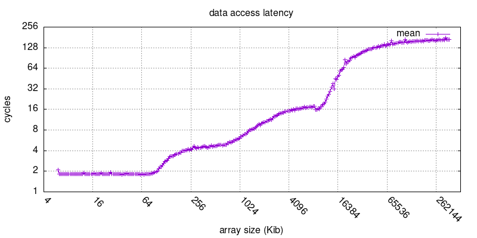

Le graphe ne semble pas totalement cohérent, l'implémentation du test est probablement incorecte.
On retrouve bien le premier pallier L1 jusqu'à 192 Kib, cependant la limite entre le pallier
L2 et L3 entre 256 et 1000 ce qui ne correspond pas à la taille théorique du cache L2.
On retrouve cependant bien le cache L3 théorique aux alentour de 8Mib. 
Ensuite la latence explose de maniere assez instable, ce qui correspond à l'acces à la RAM.

## 5) DGEMM

Les histogrames présents ci dessous représentent comparent l'efficacité de divers critères pour 
résoudre des multiplications de matrices. 
Ces critères seront : 

    * la fonction utilisée pour résoudre la dgemm
    * le compilateur
    * les flags d'optimisations

### 5.1) Comparaison des compilateurs sur chaque fonction

Dans l'ensemble Aocc performe assez mal sur sur la fonction IEX et IJK. Ce qui est décevant 
pour un compilateur amd sur un cpu amd. Aussi, Clang performe globlement mieux que gcc, sauf 
pout l'unroll 4 ou clang semble avoir du mal.
Et pour terminer, ICX performe plutot bien sur une amd.

### 5.2) Comparaison des fonctions pour chaque compilateur

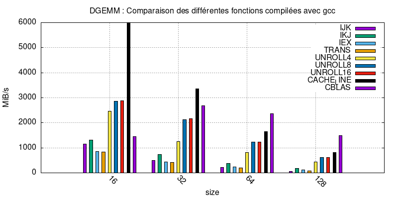

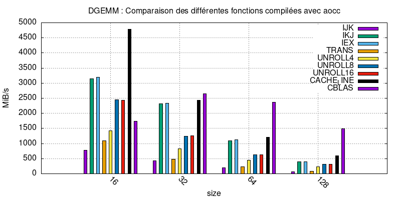

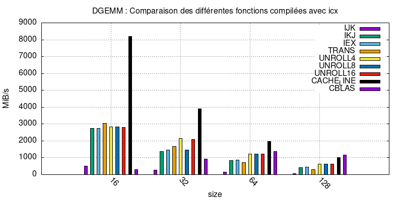

Sur les 4 compilateurs, la fonction CacheLine semble etre largment supérieur aux autres. 
A l'exeption de la fonction cblas (lapack) qui semble performer mieux quand la matrice est grande.
La fonction IKJ et IEX ont des résultats assez similaire sur gcc, aocc et icx. En comparant les binaires,
on remarque que les binaires pour IKJ et IEX sont identiques.
Aussi, la fonction Trans qui devait théoriquement fonctionner, ne semble absolument pas fonctioner sur des cpu modernes.

### 5.3) Comparaison de la performance des flags d'optimisation

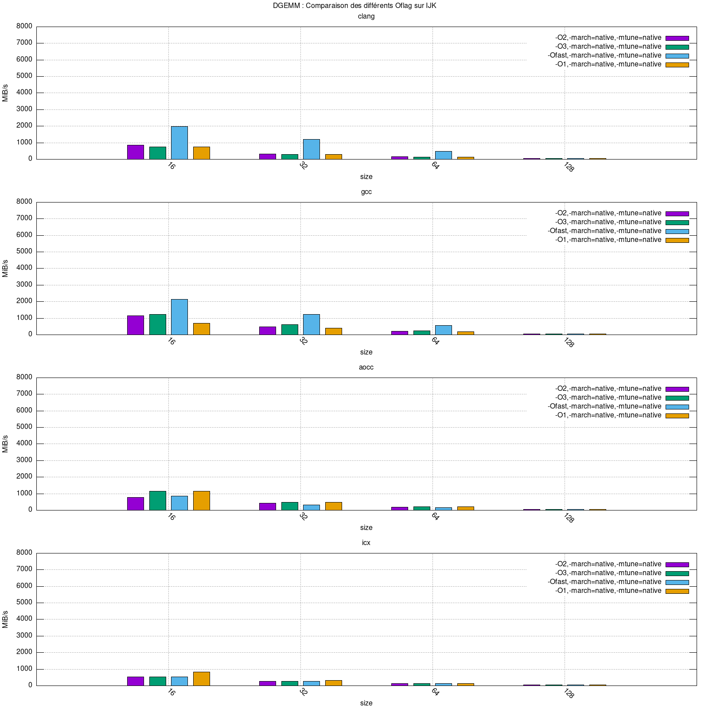

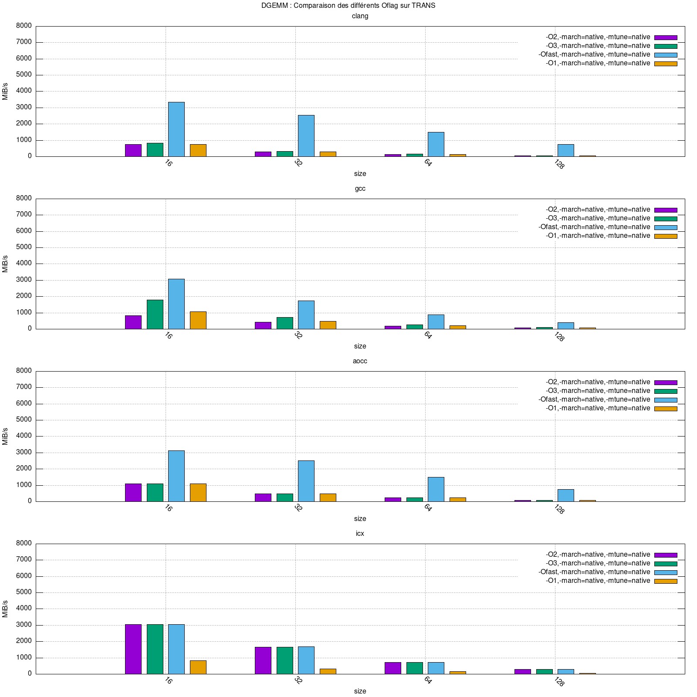

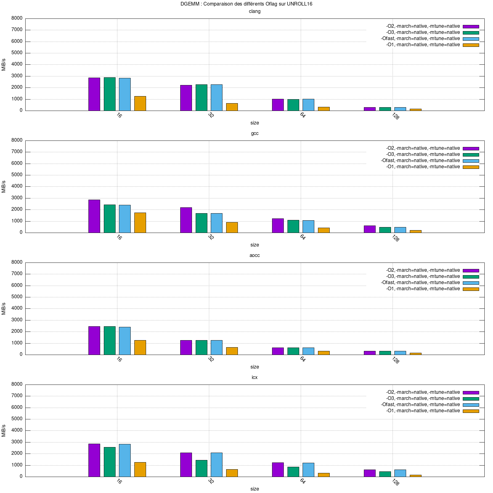

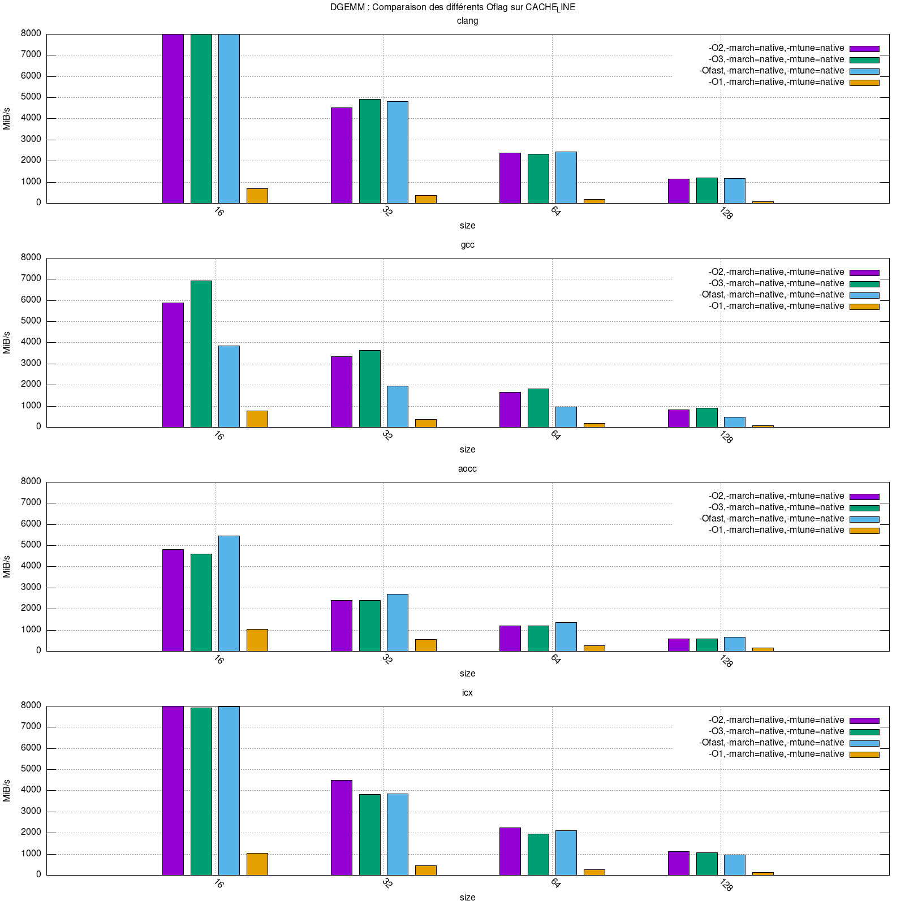

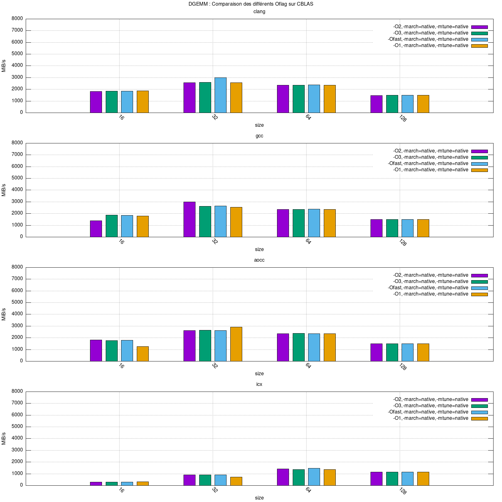

Les flags d'optimisations ont assez peu d'effets. En effet on ne retrouve pas des grosse
différence entre 02 03 et 0fast. Cependant, la fonction Trans semble devenir valable avec des flags Ofast.

## 6) DOTPROD

Les histogrames présents ci dessous représentent comparent l'efficacité de divers critères pour 
effectuer des dotprods. 
Ces critères seront : 

    * la fonction utilisée pour résoudre un dotprod
    * le compilateur
    * les flags d'optimisations

### 6.1) Comparaison des compilateurs sur chaque fonction

pour le dotprod, on remarque que la fonction icx semble performer bien mieux que les autres 
compilateurs sur BASE et UNROLL8, mais est dans la moyenne pour UNROLL4.
Les clang performe assez mal sur les 3 fonctions.

### 6.2) Comparaison des fonctions pour chaque compilateur

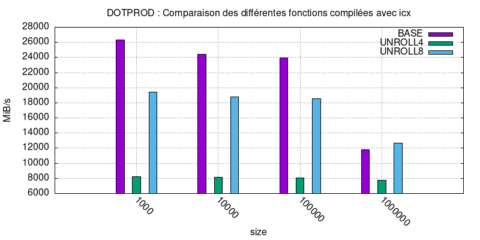

sur ces graphes, on remarque bien que icx surperforme par rapport aux autres fonctions.
Analyser l'asm produit semble nécessaire pour comprendre exactement pourquoi ce compilateur surperforme sur le dotprod

### 6.3) Comparaison de la performance des flags d'optimisation

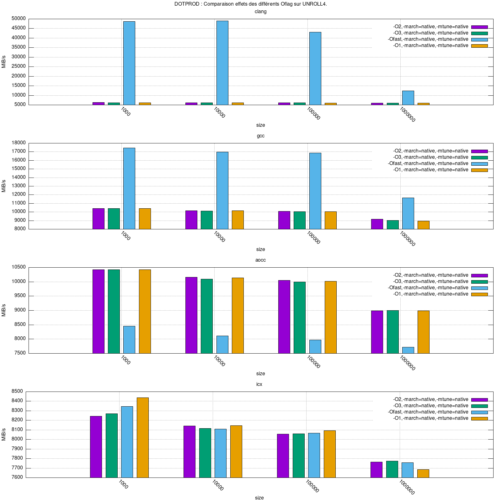

On remarqe ici que le flag d'optimisation Ofast est ultra efficace et augment jusqu'à 10 fois 
les performances, en atteignant les 100Gib/s avec clang.
<!--  -->

## 7) REDUC

Les histogrames présents ci dessous représentent comparent l'efficacité de divers critères pour 
effectuer des dotprods. 
Ces critères seront : 

    * la fonction utilisée pour résoudre un reduc
    * le compilateur
    * les flags d'optimisations

### 7.1) Comparaison des compilateurs sur chaque fonction

### 7.2) Comparaison des fonctions pour chaque compilateur

### 7.3) Comparaison de la performance des flags d'optimisation

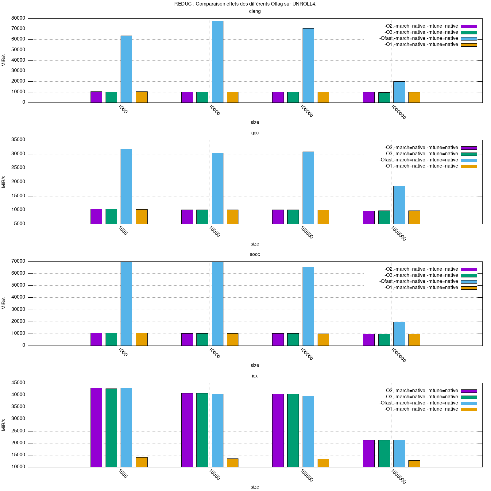

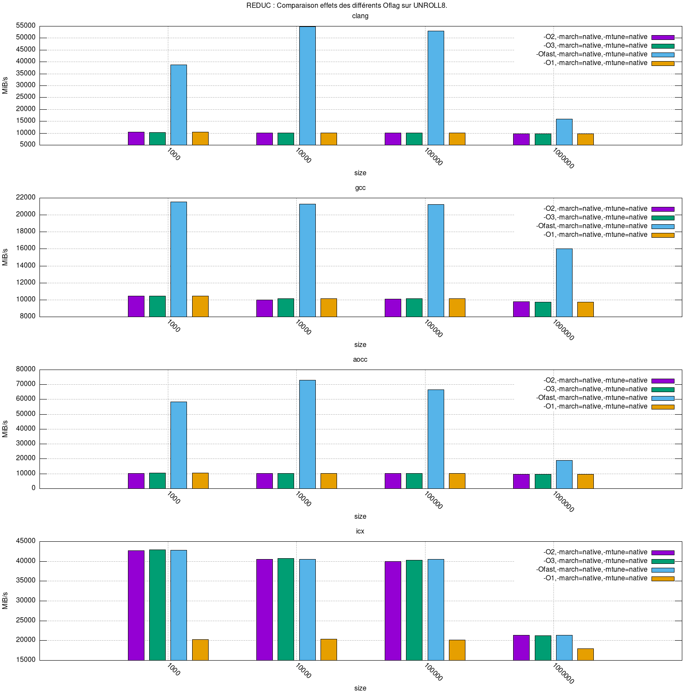

Comme sur dotprod, on remarque aussi que le flag Ofast surperforme jusqu'à *10 par rapport aux autres flags.
